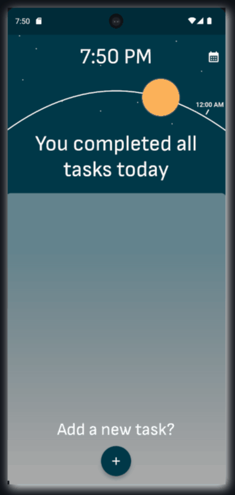
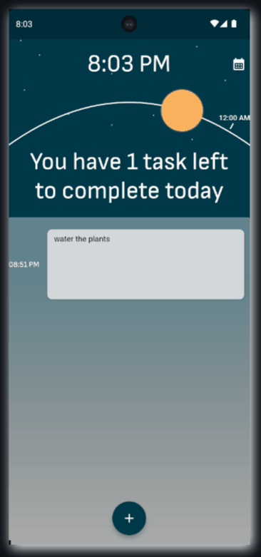
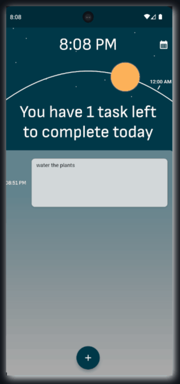
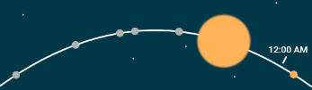
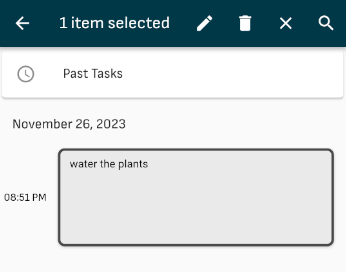
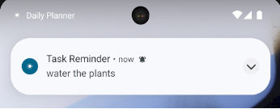
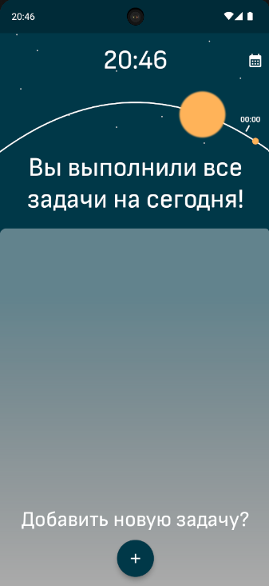

# Daily Planner

☀️ An app to manage your daily little to-do's with a fancy indicator and notifications

Made using Flutter

### Features
- 🗓️ Managing past and future tasks
- 😎 A fancy indicator to show how much you've progressed
- 🔔 Notifications to remind you of your tasks
- 🌐 Support of different languages and locales

### Showcase

  

    
    
Adding a Task

  

  

    
    
Deleting and Editing

  

  

    
    
A Fun Feature

  

### Screenshots

  

    

      
    

  

    
Tracking of progress

    

  

  

    

      
    

  

    
Managing tasks

  

  

  

    

      
    

  

    
Notifications

  

  

  

    

      
    

  

    
Support of different languages an locales

  

  

